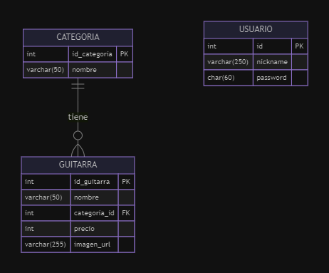

# TPE 2024 - Base de Datos para Guitarras

## Integrantes

- **Valentin Fernandez Carlomagno** (DNI: 46555388)  
- **Tomas Rios** (DNI: 46568155)

## Descripción del Proyecto

Este proyecto consiste en el diseño y desarrollo de una base de datos relacional para almacenar y gestionar información de guitarras clasificadas en diferentes categorías. La base de datos está estructurada para cumplir con una relación de **1 a N**, lo que significa que cada categoría puede contener múltiples guitarras. 

El propósito de esta base de datos es ser utilizada y administrada a través de una plataforma web, permitiendo al usuario gestionar diferentes tipos de guitarras de manera sencilla y organizada.

## Modelo de Datos

La base de datos sigue una relación **uno a muchos (1:N)** entre las siguientes tablas:

1. **Categoría**: Contiene información sobre las categorías de guitarras.
2. **Guitarra**: Contiene información detallada sobre cada guitarra, como el nombre, la categoría y su precio.

### Tablas

- **Categoría**:
  - `id_categoria`: Identificador único para cada categoría (PK).
  - `nombre`: Nombre de la categoría (e.g., Eléctrica, Acústica, Electroacústica).

- **Guitarra**:
  - `id_guitarra`: Identificador único para cada guitarra (PK).
  - `nombre`: Nombre del modelo de guitarra.
  - `categoria_id`: Identificador que referencia a la tabla `Categoría` (FK).
  - `precio`: Precio de la guitarra.
  - `imagen_url`: La URL de la imagen de la guitarra.

- **Usuario**:
  - `id`: Identificador unico para el usuario (PK).
  - `nickname`: Nombre de usuario.
  - `password`: Contraseña hasheada del usuario.

### Diagrama de la Base de Datos

A continuación se incluye un diagrama de la base de datos:



**INFORMACION**

- **PK** = Primary Key (Clave primaria)
- **FK** = Foreign Key (Clave foránea)

## Instalación y Uso

### Requisitos Previos

- Un servidor MySQL.
- Acceso a una herramienta de administración de base de datos como phpMyAdmin.

### Configuración

1. Clona el repositorio del proyecto:
   ```bash
   git clone https://github.com/FdezCarlomagno/tp_web2.git

2. Importa el archivo .sql proporcionado en tu base de datos local usando phpMyAdmin o la terminal de MySQL:
  ```bash
  tp_web2/centro_guitarras.sql

3. La base de datos se creará con datos de ejemplo que incluyen algunas guitarras y sus respectivas categorías.

## Acceso a la Administración del Sitio

Para acceder a la administración del sitio, utiliza las siguientes credenciales:

- **Usuario**: `webadmin`
- **Contraseña**: `admin`

## Despliegue en un Servidor Apache

Seguí estos pasos para desplegar la aplicación en un servidor Apache:

1. **Requisitos Previos**  
   Tener Apache y MySQL instalados y ejecutándose en tu servidor.

2. **Clonar el Repositorio del Proyecto**  
   Clona el repositorio del proyecto en tu servidor:

   ```bash
   git clone https://github.com/FdezCarlomagno/tp_web2.git

3. **Mover el Proyecto a la Carpeta Raíz de Apache**
   Coloca el directorio del proyecto (tp_web2) en la carpeta raíz de tu servidor Apache. 

4. **Acceder a la aplicación**
   Abrí tu navegador web y accede a la siguiente URL para ver la aplicación en funcionamiento:

   http://localhost/tp_web2

